# AiDesk ERD (Entity Relationship Diagram)

> Mermaid ERD 기준. SQLite(개발) / MSSQL(운영) 공통 스키마.

```mermaid
erDiagram

    %% ─────────────────────────────────────────
    %% 인증
    %% ─────────────────────────────────────────
    Users {
        int     Id          PK
        string  Username    "UNIQUE, max 50"
        string  Email       "UNIQUE, max 100"
        string  PasswordHash
        string  Role        "admin | user | guest"
        bool    IsActive
        bool    IsApproved
        datetime CreatedAt
        datetime ApprovedAt  "nullable"
        datetime LastLoginAt "nullable"
    }

    %% ─────────────────────────────────────────
    %% 고객 / 상담
    %% ─────────────────────────────────────────
    Customers {
        int     Id            PK
        string  Name          "max 100"
        string  PhoneNumber   "max 20, nullable"
        string  Email         "max 100, nullable"
        string  Company       "max 100, nullable"
        string  Position      "max 50, nullable"
        string  Notes         "max 500, nullable"
        datetime CreatedAt
        datetime LastContactDate "nullable"
        string  Status        "Active | Inactive | Lead"
    }

    Interactions {
        int     Id              PK
        int     CustomerId      FK
        string  Type            "Call | Email | Meeting | Note"
        string  Content         "max 1000"
        string  Outcome         "max 500, nullable"
        datetime CreatedAt
        datetime ScheduledDate  "nullable"
        bool    IsCompleted
        bool    IsExternalProvided
    }

    Customers ||--o{ Interactions : "has"

    %% ─────────────────────────────────────────
    %% 지식베이스 (KB)
    %% ─────────────────────────────────────────
    KnowledgeBases {
        int     Id               PK
        string  Title            "max 200, nullable"
        string  Problem          "max 500"
        string  Solution
        string  ProblemEmbedding "벡터 JSON, nullable"
        datetime CreatedAt
        datetime UpdatedAt
        string  CreatedBy        "max 100"
        string  UpdatedBy        "max 100"
        int     ViewCount
        string  Visibility       "admin | user"
        string  Platform         "공통 | windows | ..."
        string  Keywords         "Tags 컬럼명, nullable"
    }

    KnowledgeBaseSimilarQuestions {
        int     Id               PK
        int     KnowledgeBaseId  FK
        string  Question         "max 500"
        string  QuestionEmbedding "벡터 JSON, nullable"
        datetime CreatedAt
    }

    KnowledgeBases ||--o{ KnowledgeBaseSimilarQuestions : "has"

    KbPlatforms {
        int     Id        PK
        string  Name      "UNIQUE, max 50"
        bool    IsActive
        datetime CreatedAt
    }

    KnowledgeBaseWriterPromptTemplates {
        int     Id                       PK
        string  KeywordSystemPrompt
        string  KeywordRulesPrompt
        string  TopicKeywordSystemPrompt
        string  TopicKeywordRulesPrompt
        string  AnswerRefineSystemPrompt
        string  AnswerRefineRulesPrompt
        datetime CreatedAt
        datetime UpdatedAt
    }

    LowSimilarityQuestions {
        int     Id                PK
        string  Question          "max 1000"
        string  Role              "max 20"
        string  Platform          "max 50"
        float   TopSimilarity
        string  TopMatchedQuestion "max 500, nullable"
        datetime CreatedAt
        bool    IsResolved
        datetime ResolvedAt       "nullable"
    }

    %% ─────────────────────────────────────────
    %% 문서 지식베이스
    %% ─────────────────────────────────────────
    DocumentKnowledges {
        int     Id           PK
        string  FileName     "max 260"
        string  DisplayName  "max 260"
        string  Visibility   "admin | user"
        string  Platform     "공통 | ..."
        string  Status       "ready | processing | done | error"
        datetime CreatedAt
        datetime UpdatedAt
        string  CreatedBy    "max 100"
        string  UpdatedBy    "max 100"
    }

    DocumentKnowledgeChunks {
        int     Id                   PK
        int     DocumentKnowledgeId  FK
        int     PageNumber
        int     ChunkOrder
        string  Content
        string  ContentEmbedding     "벡터 JSON, nullable"
        datetime CreatedAt
    }

    DocumentKnowledges ||--o{ DocumentKnowledgeChunks : "has"

    %% ─────────────────────────────────────────
    %% 챗봇 세션 / 메시지
    %% ─────────────────────────────────────────
    ChatSessions {
        int     Id           PK
        string  Title        "nullable"
        string  UserRole     "admin | user"
        string  Platform     "max 50"
        datetime CreatedAt
        datetime UpdatedAt
        int     MessageCount
    }

    ChatMessages {
        int     Id                   PK
        int     SessionId            FK
        string  Role                 "user | bot"
        string  Content
        datetime CreatedAt
        string  RelatedKbIds         "JSON 배열, nullable"
        string  RelatedKbMeta        "JSON 배열, nullable"
        string  RelatedDocumentMeta  "JSON 배열, nullable"
        string  RetrievalDebugMeta   "JSON, nullable"
        float   TopSimilarity        "nullable"
        bool    IsLowSimilarity
    }

    ChatSessions ||--o{ ChatMessages : "has"
```

## 테이블 요약

| 그룹 | 테이블 | 설명 |
|------|--------|------|
| 인증 | `Users` | 사용자 계정 (관리자 승인 기반) |
| 고객/상담 | `Customers` | 고객 정보 |
| 고객/상담 | `Interactions` | 고객별 상담 이력 |
| 지식베이스 | `KnowledgeBases` | Q&A 형식 KB 항목 |
| 지식베이스 | `KnowledgeBaseSimilarQuestions` | KB별 유사 질문 (벡터 검색용) |
| 지식베이스 | `KbPlatforms` | 플랫폼 목록 (공통, windows, ...) |
| 지식베이스 | `KnowledgeBaseWriterPromptTemplates` | KB 생성용 프롬프트 템플릿 |
| 지식베이스 | `LowSimilarityQuestions` | 유사도 미달 질문 로그 |
| 문서 KB | `DocumentKnowledges` | 업로드된 문서 파일 정보 |
| 문서 KB | `DocumentKnowledgeChunks` | 문서 청크 (벡터 검색용) |
| 챗봇 | `ChatSessions` | 채팅 세션 |
| 챗봇 | `ChatMessages` | 세션별 메시지 |

## 벡터 저장소 (Qdrant)

SQLite/MSSQL 외에 Qdrant 컬렉션 `aidesk_kb` 에 벡터를 별도 저장합니다.

| 포인트 타입 | 연결 엔티티 | payload 필드 |
|-------------|-------------|-------------|
| KB 대표 질문 | `KnowledgeBases.Id` | `kb_id`, `type="representative"` |
| KB 유사 질문 | `KnowledgeBaseSimilarQuestions.Id` | `kb_id`, `similar_question_id`, `type="similar"` |
| 문서 청크 | `DocumentKnowledgeChunks.Id` | `document_id`, `chunk_id`, `type="document_chunk"` |
