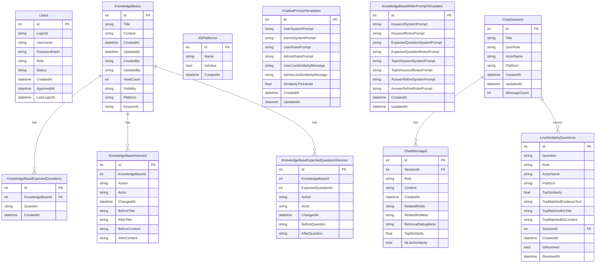

# AiDesk ERD

이 문서는 현재 RDB 스키마와 Qdrant 벡터 저장 구조를 함께 설명합니다.

---

## 1. 개념 요약

AiDesk는 아래 두 저장소를 함께 사용합니다.

1. RDB
   - 사용자, KB, 예상질문, 채팅 세션, 메시지, 프롬프트, 저유사도 로그 저장
2. Qdrant
   - KB 본문 document 포인트와 예상질문 expected 포인트 저장

중요한 호환 사항

- LowSimilarityQuestions.TopMatchedEvidenceText 속성은 DB 컬럼 TopMatchedQuestion에 매핑됩니다.
- 즉, 코드와 API는 TopMatchedEvidenceText를 사용하지만 DB 컬럼명은 legacy 호환 때문에 유지됩니다.

---

## 2. 논리 ERD

---

## 3. 테이블별 설명

### 3.1 Users

- 로그인 계정과 권한, 승인 상태 관리

### 3.2 KnowledgeBases

- 실제 답변 근거가 되는 KB 본문 저장
- Visibility는 user 또는 admin
- Platform은 공통 또는 특정 플랫폼명 문자열
- Keywords는 검색 보조용 문자열

### 3.3 KnowledgeBaseExpectedQuestions

- KB별 예상질문 저장
- Qdrant expected 포인트의 원본 데이터 역할

### 3.4 KnowledgeBaseHistories

- KB 제목/본문 변경 이력 저장

### 3.5 KnowledgeBaseExpectedQuestionHistories

- 예상질문 추가, 수정, 삭제 이력 저장

### 3.6 KbPlatforms

- 관리 화면에서 쓰는 플랫폼 마스터

### 3.7 ChatbotPromptTemplates

- 챗봇 시스템 프롬프트, 규칙 프롬프트, 저유사도 안내문, 임계치 저장
- SimilarityThreshold는 현재 semanticScore 판정 기준값

### 3.8 KnowledgeBaseWriterPromptTemplates

- 작성 보조 기능에 쓰는 프롬프트 저장

### 3.9 LowSimilarityQuestions

- ask 요청 결과가 저유사도일 때 적재
- TopSimilarity는 최상위 semanticScore
- TopMatchedEvidenceText는 애플리케이션 속성명
- 실제 DB 컬럼명은 TopMatchedQuestion

### 3.10 ChatSessions

- 채팅 세션 메타 정보 저장

### 3.11 ChatMessages

- user와 bot 메시지 본문 저장
- bot 메시지에는 RAG 메타도 함께 저장

메타 필드 의미

| 필드 | 설명 |
|---|---|
| RelatedKbIds | 최종 selected KB ID 배열 JSON |
| RelatedKbMeta | selected KB 중심 요약 메타 JSON |
| RetrievalDebugMeta | RetrievalDiagnostics 전체 JSON |
| TopSimilarity | 최상위 semanticScore |
| IsLowSimilarity | 임계치 미달 여부 |

---

## 4. Qdrant 벡터 구조

컬렉션명: aidesk_kb

포인트 타입

1. document 포인트
   - KB당 1개
   - 제목과 본문 기반 임베딩
2. expected 포인트
   - 예상질문당 1개
   - 질문 문장 기반 임베딩

payload 주요 필드

| 필드 | 설명 |
|---|---|
| kbId | 원본 KB ID |
| type | document 또는 expected |
| visibility | user 또는 admin |
| platforms | 검색 필터용 플랫폼 배열 |
| keywords | 검색 보조 키워드 |
| updatedAt | 마지막 갱신 시각 |
| title | document 포인트의 KB 제목 |
| content | document 포인트의 KB 본문 |
| question | expected 포인트의 예상질문 |

---

## 5. RDB와 Qdrant의 역할 분리

| 영역 | RDB | Qdrant |
|---|---|---|
| KB 원문 저장 | 예 | 아니오 |
| 예상질문 저장 | 예 | 아니오 |
| 임베딩 벡터 저장 | 아니오 | 예 |
| 채팅 세션/메시지 저장 | 예 | 아니오 |
| 저유사도 로그 저장 | 예 | 아니오 |
| 검색 실행 | 아니오 | 예 |

핵심 포인트

- 현재 구현은 ProblemEmbedding, QuestionEmbedding 같은 RDB 컬럼을 사용하지 않습니다.
- 임베딩 벡터는 Qdrant upsert 시점에 생성되고 유지됩니다.

---

## 6. 발표용 체크포인트

1. 검색 판단은 semanticScore 기준입니다.
2. 키워드 보정은 diagnostics와 후보 정렬에만 반영됩니다.
3. selected KB만 ViewCount와 Chat 통계에 반영됩니다.
4. legacy DB 컬럼명 TopMatchedQuestion은 호환용이며, 코드와 API 계약은 TopMatchedEvidenceText입니다.
