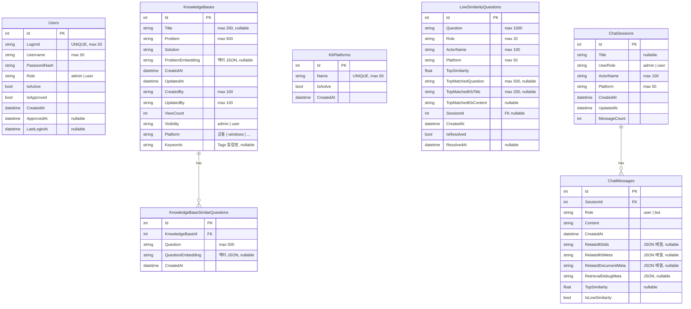

# AiDesk ERD (Entity Relationship Diagram)

> Mermaid ERD 기준. SQLite(개발) / MSSQL(운영) 공통 스키마.

## 테이블 요약

| 그룹 | 테이블 | 설명 |
|------|--------|------|
| 인증 | `Users` | 사용자 계정 (LoginId + Username, 관리자 승인 기반) |
| 지식베이스 | `KnowledgeBases` | 문제(Problem)+해결(Solution) 형식 KB 항목 |
| 지식베이스 | `KnowledgeBaseSimilarQuestions` | KB별 유사 질문 (벡터 검색용) |
| 지식베이스 | `KbPlatforms` | 플랫폼 목록 (공통, windows, ...) |

| 지식베이스 | `LowSimilarityQuestions` | 유사도 미달 질문 로그 (ActorName, SessionId 포함) |
| 챗봇 | `ChatSessions` | 채팅 세션 (ActorName 포함) |
| 챗봇 | `ChatMessages` | 세션별 메시지 |

## 벡터 저장소 (Qdrant)

SQLite/MSSQL 외에 Qdrant 컬렉션 `aidesk_kb` 에 벡터를 별도 저장합니다.

| 포인트 타입 | 연결 엔티티 | payload 필드 |
|-------------|-------------|-------------|
| KB 대표 질문 | `KnowledgeBases.Id` | `kb_id`, `type="representative"` |
| KB 유사 질문 | `KnowledgeBaseSimilarQuestions.Id` | `kb_id`, `similar_question_id`, `type="similar"` |
