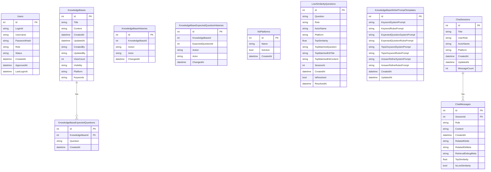

# AiDesk ERD (현재 스키마 기준)

## 테이블 요약

- `Users`: 로그인/권한/승인 상태
- `KnowledgeBases`: KB 본문
- `KnowledgeBaseExpectedQuestions`: KB별 예상질문
- `KnowledgeBaseHistories`: KB 본문 변경 이력
- `KnowledgeBaseExpectedQuestionHistories`: 예상질문 변경 이력
- `KbPlatforms`: 플랫폼 마스터
- `LowSimilarityQuestions`: 저유사도 질문 로그
- `KnowledgeBaseWriterPromptTemplates`: KB 작성 보조 프롬프트
- `ChatSessions`: 세션 메타
- `ChatMessages`: 사용자/봇 메시지 + 검색 메타

## 벡터 저장소(Qdrant)

RDB 외에 Qdrant `aidesk_kb` 컬렉션에 벡터를 저장합니다.

- `document` 포인트: KB 본문 임베딩 (KB당 1개)
- `expected` 포인트: 예상질문 임베딩 (질문당 1개)

payload 주요 필드:
- `kbId`, `type`, `question`, `visibility`, `platforms`, `keywords`, `updatedAt`

노트:
- 과거 문서의 `ProblemEmbedding`, `QuestionEmbedding` DB 컬럼 설명은 현재 구조와 다릅니다.
